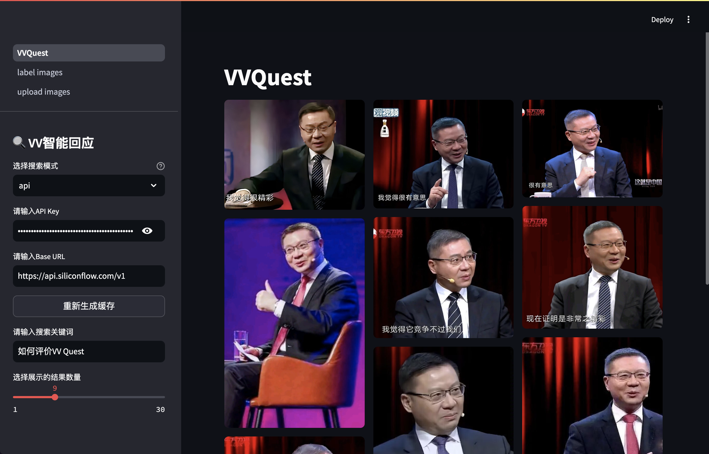
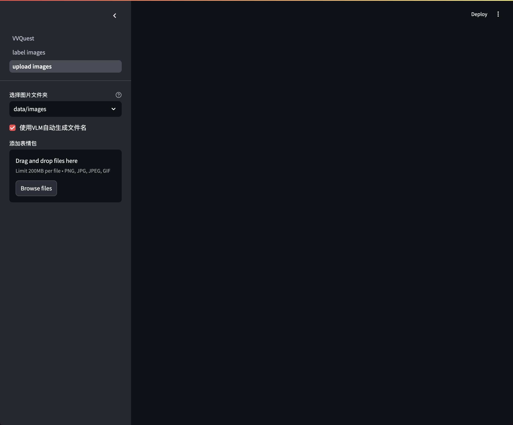
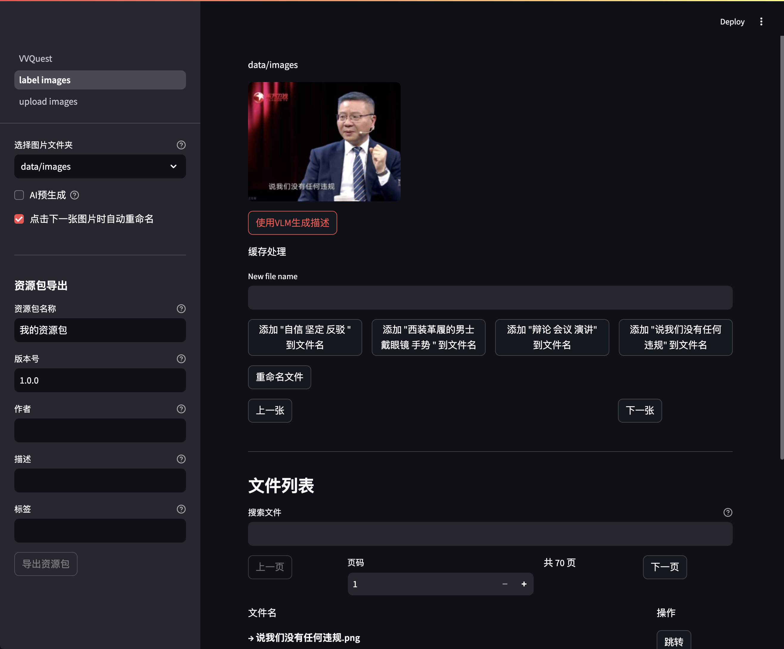

<div align="center">

<pre align="center">
███╗   ███╗███████╗███╗   ███╗███████╗███╗   ███╗███████╗ ██████╗ ██╗    ██╗
████╗ ████║██╔════╝████╗ ████║██╔════╝████╗ ████║██╔════╝██╔═══██╗██║    ██║
██╔████╔██║█████╗  ██╔████╔██║█████╗  ██╔████╔██║█████╗  ██║   ██║██║ █╗ ██║
██║╚██╔╝██║██╔══╝  ██║╚██╔╝██║██╔══╝  ██║╚██╔╝██║██╔══╝  ██║   ██║██║███╗██║
██║ ╚═╝ ██║███████╗██║ ╚═╝ ██║███████╗██║ ╚═╝ ██║███████╗╚██████╔╝╚███╔███╔╝
╚═╝     ╚═╝╚══════╝╚═╝     ╚═╝╚══════╝╚═╝     ╚═╝╚══════╝ ╚═════╝  ╚══╝╚══╝ 
</pre>

_✨ 通过自然语言检索表情包 ✨_

[在线体验](https://zvv.quest) · [反馈问题](https://github.com/MemeMeow-Studio/MemeMeow/issues) · [参与贡献](https://github.com/MemeMeow-Studio/MemeMeow/pulls)

[](LICENSE)
[](https://www.python.org)
[](https://zvv.quest)

---

<p align="center">
    <a href="#-features">Features</a> •
    <a href="#-screenshots">Screenshots</a> •
    <a href="#-quick-start">Quick Start</a> •
    <a href="#-usage">Usage</a> •
    <a href="#-api">API</a> •
    <a href="#-related-applications">Related Applications</a>
</p>

</div>

<a id="-features"></a>
## ✨ Features

> [!CAUTION]
> 本项目返回表情包结果由AI生成，与本人观点无关。

- **自然语言处理**: 采用嵌入模型，实现 Q&A 式的检索，能够对给出问题自动使用表情包回应。
- **高拓展性**: 可结合 VLM 高效为图片打上标签，制作资源包并在 [Issues](https://github.com/MemeMeow-Studio/MemeMeow/issues) 中分享。
- **便捷使用**: 提供现成的web（无法导入资源包），[MMIME](https://github.com/MemeMeow-Studio/MemeMeowIME)输入法使用，API使用，以及iOS捷径使用，可不用部署到本地。
- **社区驱动**：能够在社区分享自己制作的表情包资源包！
- 另外，**单纯使用检索功能**，若使用API无需任何花费💰


Mememeow 是一个基于自然语言的表情包检索工具。它能让你通过描述想要的场景，快速找到合适的表情包。不再需要记住具体的文件名或标签，就能轻松找到想要的表情！

<a id="-screenshots"></a>
## 📸 Screenshots

<table>
<tr>
<td width="50%">

<p align="center">主页面 - 表情包检索</p>
</td>
<td width="50%">

<p align="center">Web界面展示</p>
</td>
</tr>
<tr>
<td width="50%">

<p align="center">上传页面 - 添加新表情包</p>
</td>
<td width="50%">

<p align="center">标签页面 - 为表情包添加描述</p>
</td>
</tr>
</table>

## ℹ️ Data Source

本项目张维为表情包来源于 [知乎](https://www.zhihu.com/question/656505859/answer/55843704436)

> [!CAUTION]
> 若有侵权，请联系删除

<a id="-quick-start"></a>
## 🚀 Quick Start

### 环境要求

- Python 3.11+
- 可选: Silicon Flow API Key (用于云端模型) / OpenAI API Key (用于 VLM 打标)

### 安装步骤

1. 克隆仓库
```bash
git clone https://github.com/MemeMeow-Studio/MemeMeow.git
cd MemeMeow
```

2. 安装依赖
```bash
pip install -r requirements.txt
```

3. 启动应用
```bash
python -m streamlit run app.py
```

<a id="-usage"></a>
## 📖 Usage

### Basic Usage

1. 访问 Web 界面 (默认为 `http://localhost:8501`)
2. 在搜索框中输入你想要的表情包场景描述
3. 点击搜索，系统会返回最匹配的表情包

### 图片管理

#### 上传新图片

1. 进入 `upload images` 页面
2. 在 `添加表情包` 下选择图片
3. 可选: 启用 `使用VLM自动生成文件名` 功能，这样省去人工打标的步骤

> [!CAUTION]
> 每次上传后需要重新生成缓存。

#### 图片打标

1. 进入 `label images` 页面
2. 选择图片文件夹
3. 点击 `使用VLM生成描述` 生成标签
4. 选择合适的描述并重命名文件或直接点击 `下一张` (会自动重命名)


### 导入资源包 

#### 社区资源包组 (NEW!)

1. 点击资源包管理页面，点击`添加社区资源包组URL`，输入资源包仓库的清单文件链接 (社区资源包仓库清单文件链接为https://raw.githubusercontent.com/MemeMeow-Studio/Memes-Community/refs/heads/main/community_manifest.json)，然后点击`添加url`。
2. 添加成功后，点击`更新社区资源包组`，MemeMeow会自动更新社区资源包中所有表情包库的清单文件。
3. 点击`重新扫描资源包`，社区资源包会出现在下方；启用你要使用的


##### 社区资源包工作原理
社区资源包分为 
- 资源包组仓库更新信息community_manifest.json
- 表情包仓库metadata.json
- 表情包库manifest.json。

点击资源包管理页面，添加一个community_manifest的url，然后点击更新按钮。每次更新，MemeMeow会对比url指向的manifest和本地manifest中，每个**表情包库**的timestamp；

如果存在更新，则根据清单文件的信息，针对有更新的表情包库，重新下载表情包库的清单文件。

下载完成的资源包跟在线资源包的管理方式一致。

示例社区清单文件链接：

https://raw.githubusercontent.com/MemeMeow-Studio/Memes-Community/refs/heads/main/community_manifest.json

更多详细信息，可以查看[MemeCommunity仓库](https://github.com/MemeMeow-Studio/MemesLib-Community)

> Q: 社区资源包组，表情包仓库和表情包库有什么区别？
> A: 社区资源包组可以存放多个表情包库，方便在MemeMeow中统一管理；
> 表情包仓库只是方便存放多个表情包库，本身的文件（metadata.json）不会被除了仓库自己以外的程序使用。
> 表情包库是管理一组表情包的最小单元，可以作为独立的`在线资源包`添加，可以被**社区资源包组仓库**管理。

> Q: 能够导入多个社区资源包链接吗？
> A: 可以！你可以自己建立一个表情包仓库，或者结构相似的文件服务器，然后用相同的方法生成资源包仓库清单文件，然后导入MemeMeow。

#### 在线资源包

点击资源包管理页面，点击`导入在线资源包`，输入资源包链接，按下回车。

导入在线资源包只会下载一个manifest，存储所有图片的url路径和文件名。文件名用于匹配查询；匹配到图片后，会自动根据url联网下载图片，并缓存到本地，避免下载整个资源包。

示例资源包链接：(导入时输入)

https://github.com/MemeMeow-Studio/VVfromVideo/raw/main/all_vvs/manifest.json

示例仓库链接：

https://github.com/MemeMeow-Studio/MemesLib-Community

> Q: 导入在线资源包功能和社区资源包组功能有什么区别？
> A: 社区资源包组功能能够自动管理，一键更新社区资源包组仓库中管理的所有在线资源包，入口统一，更加方便。


#### 离线资源包

点击资源包管理，点击导入资源包，选择资源包，点击导入。
> [!CAUTION]
> 导入资源包后，需要重新生成缓存。


### 导出资源包

1. 检查图片已经完全标记完成
2. 填写资源包相关信息
3. 点击 `导出资源包` 按钮
4. 等待生成完成后点击 `下载资源包`

> [!TIP]
> 你可以在 [Issues](https://github.com/MemeMeow-Studio/MemeMeow/issues) 中分享你的资源包，或者查看其他用户分享的资源包。

<a id="-api"></a>
## 🔌 API

本项目开放 API 接口，共各位开发者快捷使用，具体请求方式如下：

### Endpoint
`GET https://api.zvv.quest/search`

### 请求参数
| 参数名 | 类型 | 简介 | 是否必填 | 范围 |
|-----------|--------|-----------------------------------------------|----------|----------------------|
| `q`       | string | 要查询的内容（例如关键词或某个话题）  | ✅       | -                    |
| `n`       | integer| 返回的图片数量 | ✅       | 1 - 50               |

### 返回格式
返回格式为json，结构如下：

| 字段   | 数据类型 | 简介 |
|----------|-----------|-----------------------------------------------|
| `code`   | int    | 响应状态码 (200代表成功) |
| `data`   | string[]  | 图片的URL列表 |
| `msg`    | string    | 如果响应出错的情况下，对应的错误信息，成功时为空 |


<a id="-related-applications"></a>
## 📦 Related Applications

Mememeow 相关应用:

| 应用 | 作者   | GitHub | 链接 |
| --- | --- | --- | --- |
| VVQuest网页端 |  | [VVQuest](https://github.com/DanielZhangyc/VVQuest) | [链接](https://zvv.quest) |
| VVQuest*iOS*捷径 | [TomSmith163](https://github.com/TomSmith163) |  | [链接](https://www.icloud.com/shortcuts/a7084c7ae29e4de5898ce7c8386705f3) |
| HakuBot().vv() 命令 | [apple_catwaii](https://github.com/Apple-QAQ) |  | [QQ](https://qm.qq.com/cgi-bin/qm/qr?k=GJSCe1_B98V4Ni6leVtKAjQrAtJW-VG5 ) |
| VVQuest油猴脚本 | [DanielZhangyc](https://github.com/DanielZhangyc) | [vvquest-tampermonkey-extension](https://github.com/DanielZhangyc/vvquest-tampermonkey-extension) | [greasyfork](https://greasyfork.org/zh-CN/scripts/528477-vvquest-vv%E8%A1%A8%E6%83%85%E5%8C%85%E5%8A%A9%E6%89%8B) |
| Yunzai-Bot 插件 | [TomyJan](https://github.com/TomyJan) | [TomyJan/Yunzai-TomyJan-Plugin](https://github.com/TomyJan/Yunzai-TomyJan-Plugin/) |  |


> [!TIP]
> 如果你想添加你的应用，请提交 [PR](https://github.com/MemeMeow-Studio/MemeMeow/pulls) 或 [Issue](https://github.com/MemeMeow-Studio/MemeMeow/issues)

## 📄 License

本项目采用 [MIT](LICENSE) 开源协议。

## ⭐ Star History

[](https://star-history.com/#MemeMeow-Studio/MemeMeow&Date)

---

## 已知问题

由于streamlit的管理方式，每次源代码更新后刷新网页，会重新生成ImageData，造成内存泄漏。不修改源代码不会触发此问题。